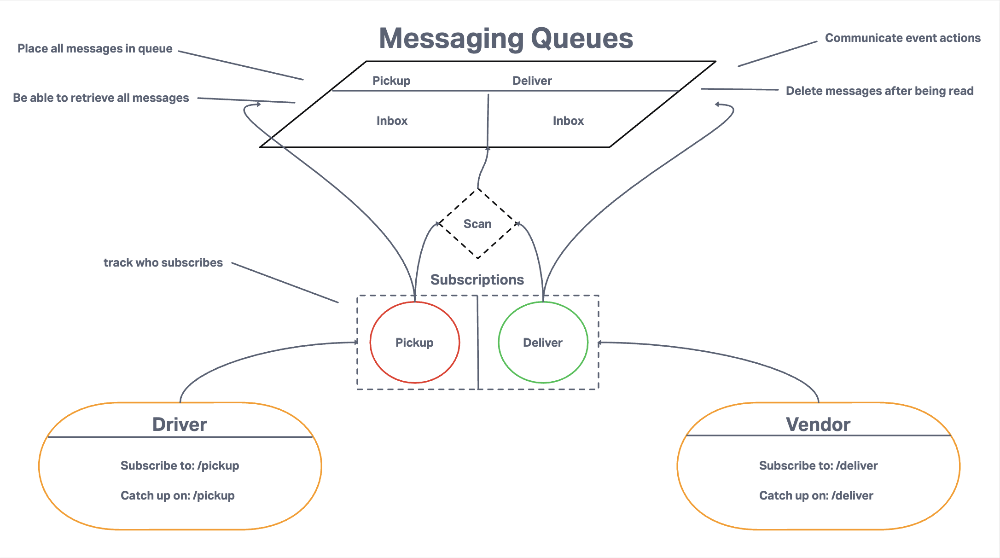

# CAPS

Postal Service app that utilizes Event-Driven Programming. This application can also serve as an open-source world resource to start your own socket.io application. Instructions on how to install socket.io and documentation references will be added here in the near future. This application will feature uses of namespaces and rooms with details in the comments explaining how everything works.

The Socket.io library is used in many real-time web apps to include gaming websites, chat rooms, and many more apps that require end-to-end communication between several servers and clients in real-time.

## UML

Using the emitter functionality to send messages between the server and its clients

## Phase 2 UML

Implementing Socket.io protocols to handle real-time bi-directional communication between the server and its clients

## Phase 3 UML

