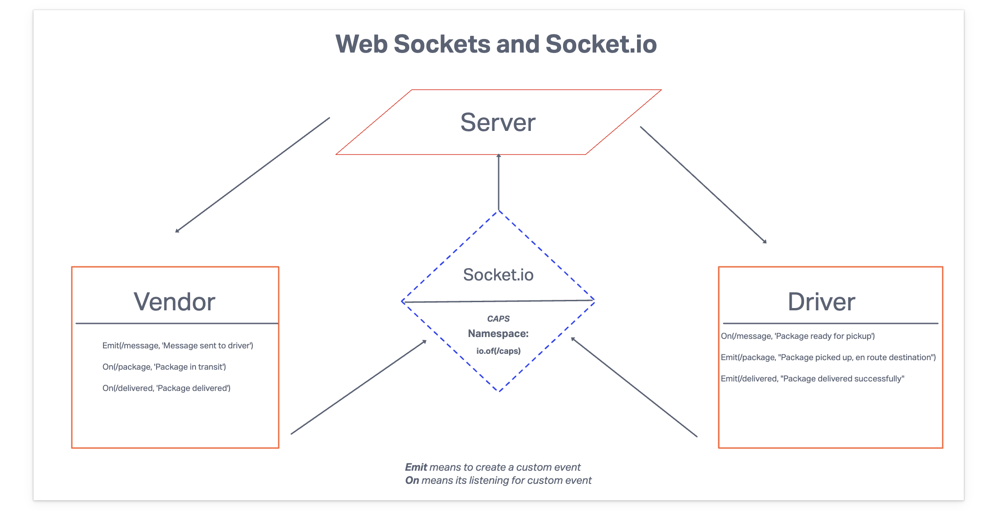

# CAPS

Postal Service app that utilizes Event-Driven Programming

## UML

Using the emitter functionality to send messages between the server and its clients

## Phase 2 UML

Implementing Socket.io protocols to handle real-time bi-directional communication between the server and its clients

